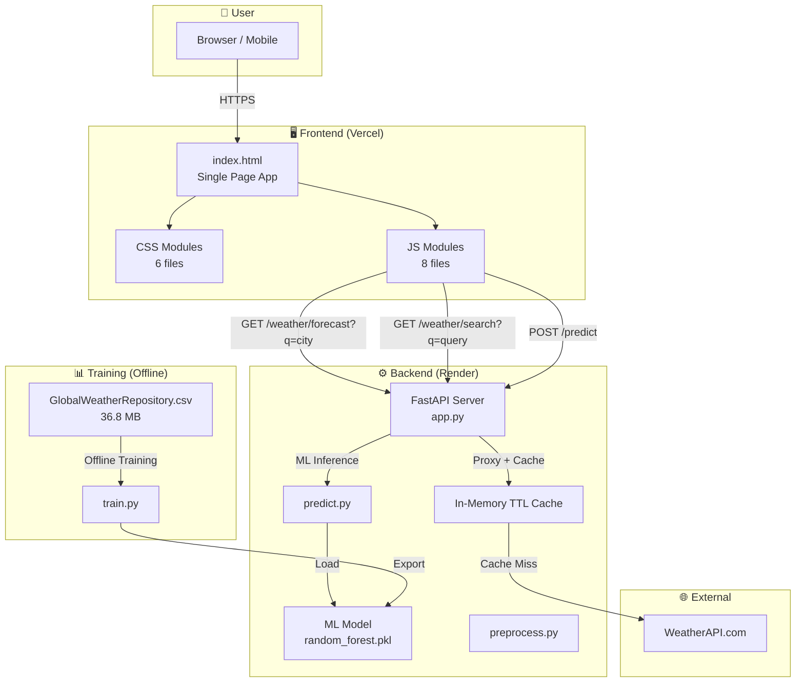
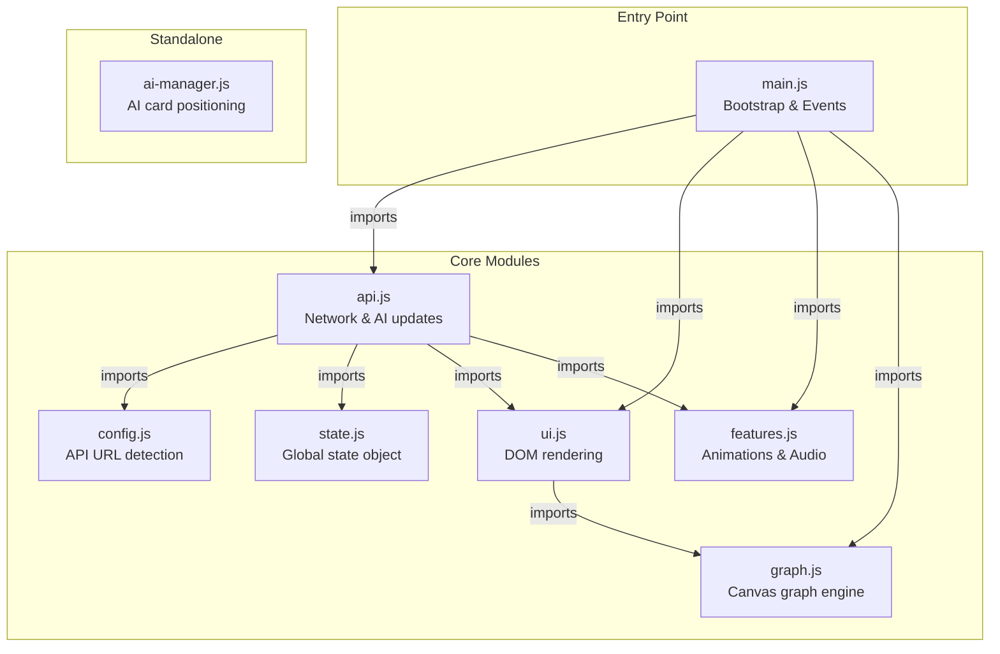
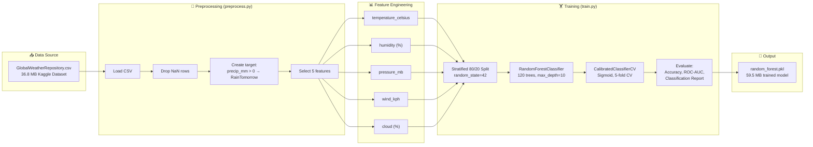
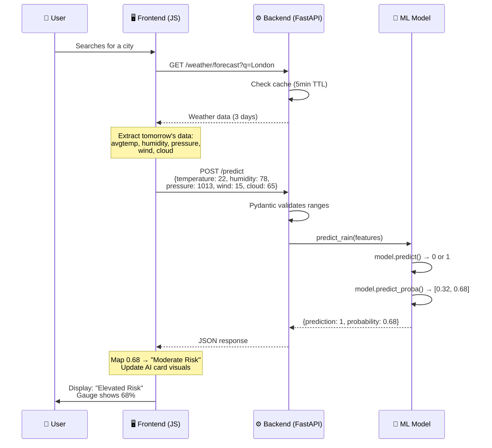
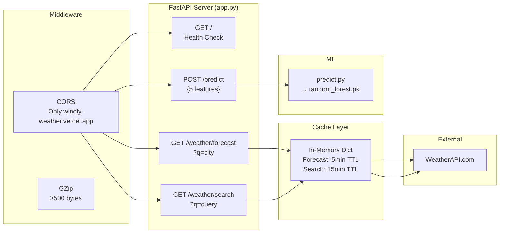
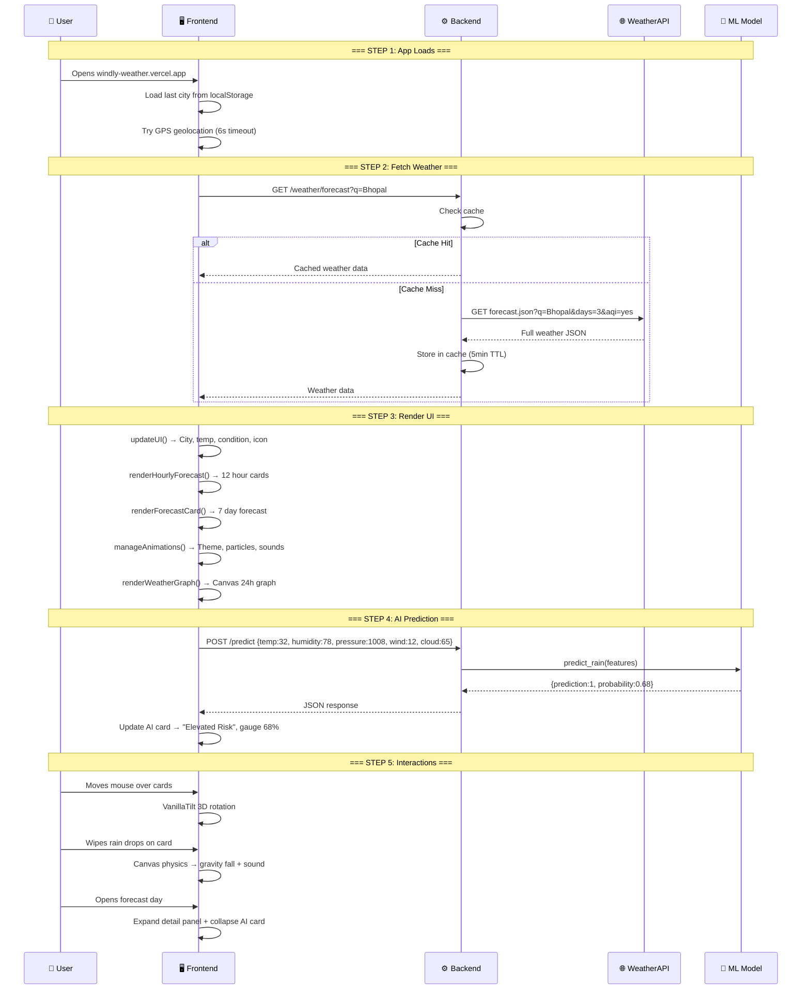
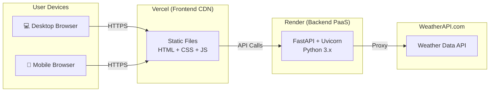

# 🌦️ Windly Weather App — Complete Architecture & Technical Documentation

## Overview

**Windly** is a full-stack, AI-powered weather application that combines real-time weather data with a Machine Learning rain prediction model. It features a premium glassmorphism UI with interactive 3D effects, canvas-based weather visualizations, and a rich particle animation system.

| Layer | Technology | Purpose |
|-------|-----------|---------|
| **Frontend** | HTML5, CSS3, Vanilla JavaScript (ES Modules) | Premium single-page weather dashboard |
| **Backend** | Python FastAPI + Uvicorn | REST API server, ML inference, weather data proxy |
| **ML Model** | scikit-learn RandomForestClassifier | Binary rain prediction (will it rain tomorrow?) |
| **External API** | WeatherAPI.com | Real-time weather data, 3-day forecasts, city search |
| **Deployment** | Vercel (Frontend) + Render (Backend) | Production hosting |

---

## 1. High-Level System Architecture



---

## 2. Complete Project File Structure

```
windly/
├── 📂 backend/                          ← Python FastAPI server
│   ├── .env                             ← API key (secret)
│   ├── requirements.txt                 ← Python dependencies
│   ├── README.md                        ← Backend documentation
│   │
│   ├── 📂 api/
│   │   └── app.py                       ← FastAPI server (main entry point)
│   │
│   ├── 📂 model/
│   │   ├── train.py                     ← ML training pipeline
│   │   ├── predict.py                   ← ML inference module
│   │   ├── random_forest.pkl            ← Trained model (59.5 MB)
│   │   └── feature_columns.json         ← Feature names reference
│   │
│   ├── 📂 utils/
│   │   └── preprocess.py                ← Data cleaning utilities
│   │
│   └── 📂 data/
│       └── GlobalWeatherRepository.csv  ← Training dataset (36.8 MB)
│
└── 📂 frontend/                         ← Static web app
    ├── index.html                       ← Main (only) HTML page
    ├── style.css                        ← CSS import aggregator
    ├── favicon.ico                      ← App icon
    ├── vercel.json                      ← Deployment config
    │
    ├── 📂 css/
    │   ├── base.css                     ← CSS reset & variables
    │   ├── themes.css                   ← 11 weather background themes
    │   ├── layout.css                   ← Responsive grid & breakpoints
    │   ├── components.css               ← All UI component styles
    │   ├── animations.css               ← Particles, lightning, effects
    │   └── enhancements.css             ← Polish, interactions, GPU optimizations
    │
    ├── 📂 js/
    │   ├── config.js                    ← API URL auto-detection
    │   ├── state.js                     ← Global app state
    │   ├── main.js                      ← Bootstrap, event wiring, gestures
    │   ├── api.js                       ← Network layer, AI card updates
    │   ├── ui.js                        ← DOM rendering (cards, forecasts)
    │   ├── features.js                  ← Animations, audio, particle engine
    │   ├── graph.js                     ← Canvas-based 24-hour graph
    │   └── ai-manager.js               ← AI card positioning logic
    │
    ├── 📂 images/
    │   └── windly-social-preview.png    ← Social media preview image
    │
    └── 📂 sound/
        ├── bird.mp3, crickets.mp3       ← Ambient nature sounds
        ├── heavy-rain.mp3, light-rain.mp3 ← Rain audio
        ├── thunder.mp3, wind.mp3        ← Storm audio
        ├── water-drop.mp3, ding.mp3     ← Interaction sounds
        └── foot-step-snow.mp3           ← Snow crunch sound
```

---

## 3. Frontend Architecture — Module Dependency Graph



### What Each JS File Does

| File | Lines | Responsibility |
|------|-------|---------------|
| **config.js** | 13 | Auto-detects dev (`localhost:8000`) vs production (`onrender.com`) API URL |
| **state.js** | 22 | Single `appState` object: sound toggle, temperature unit (°C/°F), city history, weather conditions |
| **main.js** | 375 | App bootstrap on `DOMContentLoaded`: renders city history, starts clock, wires all button/search/voice/GPS events, manages forecast panel open/close, swipe-to-close gestures |
| **api.js** | 341 | Network layer: `fetchData(city)` fetches weather with 50s timeout (handles Render cold starts), `fetchSuggestions()` for autocomplete, `getAIPrediction()` POSTs to ML model and updates AI card visuals |
| **ui.js** | 523 | Renders ALL DOM content: city name, temperature, feels-like, condition, weather icon, hourly forecast strip (12 hours), 7-day forecast with expandable detail panels, dashboard stats (AQI, UV, wind, humidity, pressure, moon), sun arc animation |
| **features.js** | 701 | Animation engine: particle system (rain drops, snowflakes, cloud bits, wind lines, shooting stars), canvas-based interactive physics (wipe rain/snow with mouse), lightning bolts, ambient sounds (rain, birds, crickets, thunder), weather theme management, extreme heat sun effect |
| **graph.js** | 941 | Pure Canvas 2D graph: plots temperature, feels-like, humidity, dew point, rain probability, UV index over 24 hours. Animated left-to-right draw, night/dawn bands, comfort zone, hover tooltips, peak marker |
| **ai-manager.js** | 106 | Moves the AI Prediction card between desktop (inside forecast) and mobile (inside forecast days) layouts. Collapses with animation when forecast day details are expanded |

---

## 4. CSS Architecture

| File | Lines | Purpose |
|------|-------|---------|
| **base.css** | 25 | CSS reset, CSS variable `--primary: #00f2fe`, Poppins font, body styling |
| **themes.css** | 42 | 11 weather-driven background gradients (sunny, rainy, cloudy, night, stormy, snowy, etc.) |
| **layout.css** | 248 | Responsive layout with 4 breakpoints: desktop → tablet → mobile → compact |
| **components.css** | 1046 | All visual components: glassmorphism cards, search box, dashboard panels, forecast rows, graph card |
| **animations.css** | 299 | Keyframe animations: rain fall, snow sway, cloud drift, lightning flash, sun arc, shooting stars |
| **enhancements.css** | 647 | Polish layer: micro-interactions, hover effects, expandable panels, mobile GPU optimizations, CSS containment |

---

## 5. ML Rain Prediction Model — Complete Pipeline

### 5.1 Training Pipeline



### 5.2 Model Details

| Parameter | Value | Explanation |
|-----------|-------|-------------|
| **Algorithm** | Random Forest | An ensemble of 120 decision trees that each vote on whether it will rain |
| **n_estimators** | 120 | Number of decision trees in the forest |
| **max_depth** | 10 | Maximum depth of each tree (prevents overfitting) |
| **min_samples_split** | 4 | Minimum samples needed to split a node |
| **Calibration** | Sigmoid (Platt Scaling), 5-fold CV | Makes the output probabilities realistic (e.g., 70% means it actually rains 70% of the time) |
| **Target Variable** | `precip_mm > 0` → Binary (0 = No Rain, 1 = Rain) | If precipitation is above 0mm, it's classified as "rain" |

### 5.3 The 5 Input Features

| # | Feature | Range | What It Measures |
|---|---------|-------|-----------------|
| 1 | **Temperature** | -90°C to 60°C | Current air temperature |
| 2 | **Humidity** | 0% to 100% | Moisture content in the air |
| 3 | **Pressure** | 870 to 1085 mb | Atmospheric pressure (low pressure → storms) |
| 4 | **Wind Speed** | 0 to 300 km/h | Wind velocity |
| 5 | **Cloud Cover** | 0% to 100% | Percentage of sky covered by clouds |

### 5.4 Inference Pipeline (How Prediction Happens at Runtime)



### 5.5 Risk Tier Mapping (Frontend)

The raw probability from the model is mapped to human-readable risk levels:

| Probability Range | Risk Level | Display Label | Card Color Theme |
|-------------------|------------|---------------|-----------------|
| 0% – 19% | 🟢 Low | Stable Conditions | Green glow |
| 20% – 39% | 🟢 Low | Low Risk | Green glow |
| 40% – 54% | 🟡 Moderate | Moderate Risk | Yellow/amber glow |
| 55% – 69% | 🟡 Moderate | Elevated Risk | Yellow/amber glow |
| 70% – 81% | 🟠 High | High Risk | Orange glow |
| 82% – 100% | 🔴 Severe | Severe Risk | Red glow |

---

## 6. Backend API Architecture



### API Endpoints

| Method | Endpoint | Cache TTL | Description |
|--------|---------|-----------|-------------|
| `GET/HEAD` | `/` | — | Health check: returns `{status: 'ok', service: 'Windly API v2.0'}` |
| `GET` | `/weather/forecast?q={city}` | 5 min | Proxies WeatherAPI forecast (3 days, AQI included) |
| `GET` | `/weather/search?q={query}` | 15 min | City autocomplete search |
| `POST` | `/predict` | — | ML inference: accepts 5 weather features, returns rain prediction + probability |

### Backend Key Features
- **Connection pooling**: `httpx.AsyncClient` with 20 max connections, 10 keepalive
- **TTL caching**: Avoids hitting WeatherAPI rate limits
- **CORS security**: Only allows requests from the production frontend domain
- **GZip compression**: Reduces response payload size
- **Input validation**: Pydantic models enforce valid ranges for all 5 ML features

---

## 7. Complete Data Flow — End to End



---

## 8. Visual Effects & Premium Features

### 8.1 Glassmorphism Design
Every card uses the "frosted glass" effect:
```css
background: linear-gradient(145deg, rgba(255,255,255,0.12), rgba(255,255,255,0.03));
backdrop-filter: blur(35px) saturate(130%);
border: 1px solid rgba(255,255,255,0.25);
box-shadow: 0 40px 80px rgba(0,0,0,0.4), inset 0 1px 0 rgba(255,255,255,0.25);
```

### 8.2 Interactive Features
| Feature | Technology | Description |
|---------|-----------|-------------|
| **3D Card Tilt** | VanillaTilt.js | Cards rotate in 3D following mouse position (4° max) |
| **Rain/Snow Physics** | Canvas 2D API | Interactive particles on main card, wipe them with mouse/touch |
| **Lightning Bolts** | SVG paths + CSS | Randomly generated branching SVG bolts with flash overlay |
| **Particle System** | CSS animations | Rain drops, snowflakes, cloud bits, wind lines spawned in `#weather-stage` |
| **Ambient Audio** | Web Audio | Context-aware: rain, thunder, birds (day), crickets (night), wind |
| **Voice Search** | Web Speech API | Full speech recognition with iOS Safari support |
| **GPS Location** | Geolocation API | Auto-detect user's city |
| **Pendulum Graph** | CSS + JS | Graph card swings in with pendulum physics, sways with mouse |

### 8.3 Weather Themes
The entire background dynamically changes based on weather conditions:

| Theme | Trigger | Colors |
|-------|---------|--------|
| Sunny | Clear day | Warm orange → yellow gradient |
| Sunny Extreme | Temp > 40°C | Deep red → orange |
| Rainy | Rain detected | Dark blue → slate |
| Stormy | Thunder conditions | Near-black → dark purple |
| Snowy | Snow detected | White → ice blue |
| Night | After sunset | Deep navy → black |
| Cloudy | Overcast | Gray → slate |
| Stargazer | Clear night | Deep purple → black with shooting stars |

---

## 9. Performance Optimizations

| Optimization | Where | Purpose |
|-------------|-------|---------|
| CSS `contain: layout style paint` | All panels | Isolates each panel for faster browser repaints during zoom |
| `backdrop-filter: blur(10px)` | Mobile AI card | Reduces GPU cost by ~65% on mobile (from 30px → 10px) |
| `translateZ(0)` | Mobile cards | Promotes elements to GPU compositor layers |
| `will-change: auto` | Mobile forecast rows | Prevents excessive GPU memory usage |
| `DocumentFragment` | Hourly forecast | Batches DOM insertions for zero layout thrash |
| `requestAnimationFrame` | AI card updates | Batches all visual updates into single frame |
| `ResizeObserver` | Graph | Defers rendering until container is actually visible |
| Particle scaling | Features.js | Mobile: ÷5, Tablet: ÷2.5 particle counts |
| TTL Cache | Backend | Avoids redundant API calls (5min forecast, 15min search) |
| Connection pooling | Backend | Reuses HTTP connections to WeatherAPI |
| GZip middleware | Backend | Compresses responses ≥500 bytes |

---

## 10. Deployment Architecture



| Component | Platform | URL |
|-----------|---------|-----|
| Frontend | Vercel | `https://windly-weather.vercel.app` |
| Backend | Render | `https://windly-backend.onrender.com` |
| Weather Data | WeatherAPI.com | `https://api.weatherapi.com/v1` |

---

## 11. Key Technical Decisions Summary

| Decision | Why |
|----------|-----|
| **No framework (Vanilla JS)** | Maximum performance, zero bundle size overhead, full control |
| **ES Modules** | Clean dependency graph, native browser support, no bundler needed |
| **FastAPI (Python)** | Async support, automatic API docs, Pydantic validation, ML ecosystem compatibility |
| **Random Forest** | Handles non-linear weather patterns well, fast inference, interpretable |
| **Sigmoid Calibration** | Raw Random Forest probabilities are unreliable; calibration makes them meaningful |
| **Server-side API proxy** | Keeps WeatherAPI key secret, enables caching, adds CORS security |
| **Canvas 2D for graph** | Full pixel control, no chart library dependency, custom visual effects |
| **CSS particles (not Canvas)** | Simpler, GPU-accelerated via `will-change`, individually styled |
| **Canvas for interactive physics** | Needed for collision detection (mouse wipe), gravity simulation |
